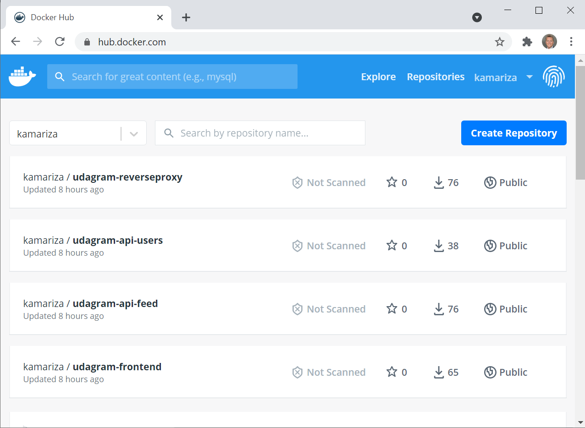
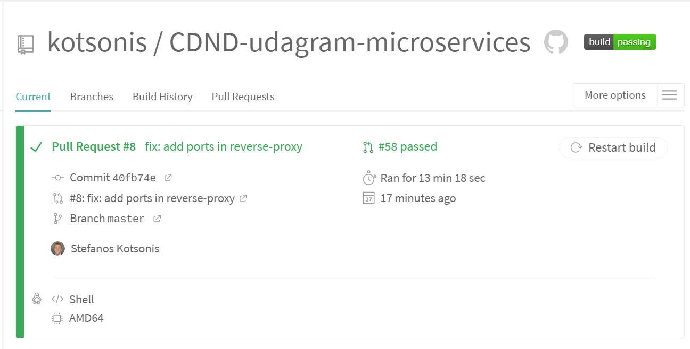
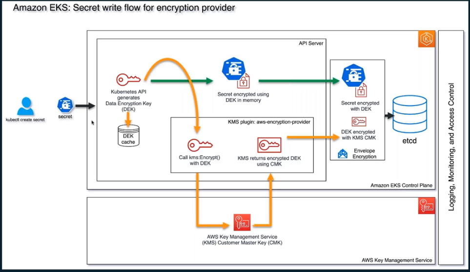
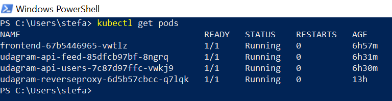
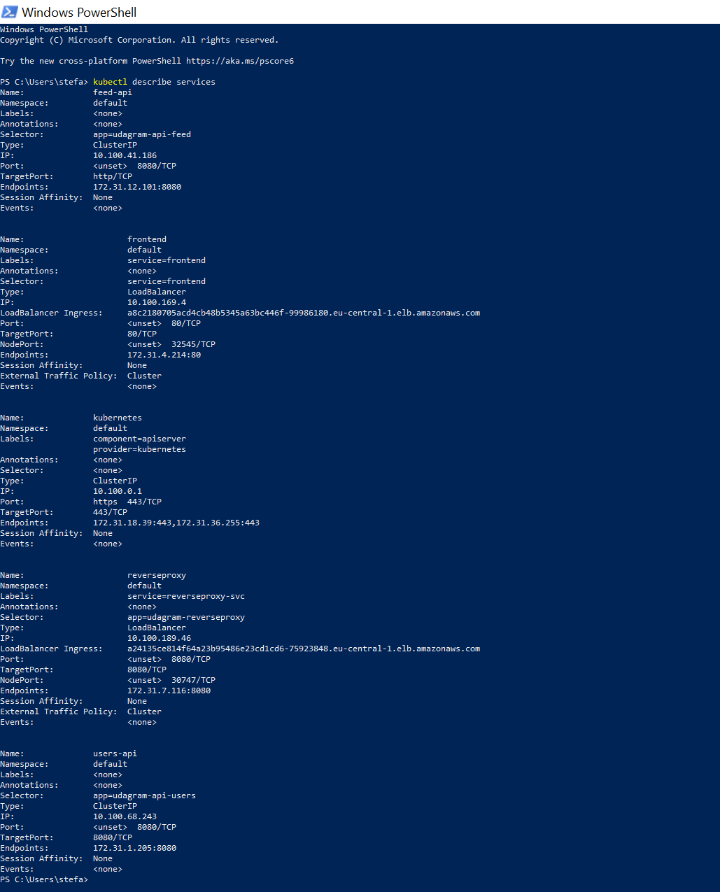
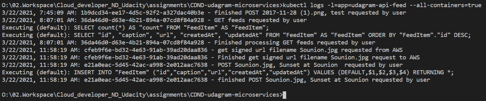

# Udagram Image Filtering Application - Udacity Cloud Developer Nanodegree Project
## 22.Mar.2021 : Stefanos Kotsonis

## Description
This project is is for the [Udacity Cloud Developer Nanodegree](https://www.udacity.com/course/cloud-developer-nanodegree--nd9990), and specifically course 3 **Monolith to Microservices at Scale**. In this course we learn best practices on how to develop and deploy microservices, with a focus on different microservice architecture patterns, independent scaling, resiliency, securing microservices, and best practices for monitoring and logging.

The task is to refactor monolith application to microservices and deploy through [AWS EKS]()
In this project, we  take an existing application named Udagram and refactor it into a microservice architecture with lean services. We build out a CI/CD process using [Travis CI](https://travis-ci.org/) that automatically builds and deploys Docker images to a Kubernetes cluster. The Kubernetes cluster is configured to help solve common challenges related to scale and security.

### Prerequisites
To implement this project you need to have the following:
1. An AWS account which you can create via the free tier at [AWS Free Tier](https://aws.amazon.com/free/?all-free-tier.sort-by=item.additionalFields.SortRank&all-free-tier.sort-order=asc)
2. Install the [AWS CLI](https://aws.amazon.com/cli/?nc2=type_a) on your development machine and initialize with your AWS credentials
3. The Node Package Manager (NPM). You will need to download and install Node from [https://nodejs.com/en/download](https://nodejs.org/en/download/). This will allow you to be able to run `npm` commands to install dependent libraries. The following are two important components of our solution:
   1. installing [Ionic CLI](https://ionicframework.com/docs/intro/cli) with `npm install -g @ionic/cli`
   2. installing the [AWS SDK](https://docs.aws.amazon.com/sdk-for-javascript/v2/developer-guide/installing-jssdk.html) with `npm install aws-sdk`
4. Create an account with [Docker Hub](https://www.docker.com/get-started) and possibly install Docker Desktop for CLI ease at the development machine
5. The Amazon vended [kubectl](https://docs.aws.amazon.com/eks/latest/userguide/install-kubectl.html) for interacting with your k8s clusters. 
# Udagram Application description

Udagram is a simple cloud application developed alongside the Udacity Cloud Engineering Nanodegree. It allows users to register and log into a web client, post photos to the feed, and process photos using an image filtering microservice.
<center>

</center>

## Project Challenge
Following tasks will have to be performed.
1. **Refactor the API** : Decompose the API code so that we can have two separate projects that can be run independent of one another.
2. **Containerize the Code** : Creating Dockerfiles for the frontend and backend applications. Each project should have its own Dockerfile.
3. **Build CICD Pipeline** : Integrate the GitHub repository with Travis CI, and create a build pipeline that will push the generated images on [DockerHub](https://hub.docker.com/).
4. **Deploy to Kubernetes** : Deploy the Docker containers for the API applications and web application as their own pods in AWS EKS.
5. **Implement Logging** : Define a logging strategy and use logs to capture metrics. As the k8s will be set up with autoscale, it is important our logging strategy allows us to segregate events from different pods.

# Solution
In order The following was implemented as a solution to the project challenge.
## Architecture

The project consists of the following containerized applications:
1. `udagram-frontend` Frontend - Angular web application built with Ionic Framework
2. `udagram-reverseproxy` Reverse Proxy - [Nginx](https://www.nginx.com/) Reverse Proxy to relay requests to internal microservices
3. `udagram-api-feed` Backend RESTful API for posting and processing photos to the feed - Node-Express application
4. `udagram-api-users` Backend RESTful API for handling user login and authentication - Node-Express application

The cloud resources being used for this project consists of:
1. [Amazon S3](https://aws.amazon.com/s3/) Object storage service used for storing the uploaded pictures.
2. [Amazon RDS](https://aws.amazon.com/rds/) Relational database service used for hosting a PostgreSQL database which contains the feeds and users
3. [Amazon EKS](https://aws.amazon.com/eks/) Elastic Kubernetes Service to start, run, and scale Kubernetes applications in the AWS cloud
4. [Amazon KMS](https://aws.amazon.com/kms/) Key management service to allow for the secrets created on Kubernetes to be encrypted (instead of just base-64 encoded)

## Task 1. Refactor the API
Refactoring the API was straightforward. Our previous backend was an Express Node.js web application that was serving the routes `\api\v0\users` and `\api\v0\feed`. Refactoring meant creating two separate Express applications, one for each route.
The important modifications were:
#### AWS RDS and S3 Bucket credentials
Ensuring that credentials are pulled from the enviroment is important, since we our applications will be containerized and available on github as well as docker hub. The following secrets are retrieved by [config.ts](udagram-api-users/src/config/config.ts) from the environment when running:
```typescript
"username": process.env.POSTGRES_USERNAME,
"password": process.env.POSTGRES_PASSWD,
"database": process.env.POSTGRES_DATABASE,
"aws_region": process.env.AWS_REGION,
"host": process.env.AWS_HOST,
"aws_media_bucket": process.env.AWS_S3_BUCKET
```
#### AWS IAM Credentials
Our backends will need to use the proper IAM credentials in order to be allowed to make calls via the [AWS SDK for JavaScript](https://docs.aws.amazon.com/sdk-for-javascript/v3/developer-guide/welcome.html). We need these calls in order to access our AWS resources like the S3 bucket, RDS, etc. This is again implemented via [config.ts](udagram-api-users/src/config/config.ts) with the following:
```typescript
"aws_profile": process.env.AWS_PROFILE
```
AWS will check the credentials of the provided profile to allow for access to resources. Since we will be having containerized apps on k8s, this will require encrypting and providing our `credentials` on the containers when they are deployed. This is explained in the Secrets section below.

#### CORS
Our Cross-Origin Resource Sharing had to be modified, since our monolithic app was restricting access from within our server `localhost`. Now, our clients will be accessing us through their frontend app that will have different IPs. The implemented CORS is as follows:
```typescript
  app.use(function(req, res, next) {
    res.header("Access-Control-Allow-Origin", "*");
    res.header("Access-Control-Allow-Headers", "Origin, X-Requested-With, Content-Type, Accept, Authorization");
    next();
  });
```
#### Allowing the frontend to communicate with the backend
Our frontend communicates with the API through port `8080` and receives the requested data according to the `path` provided. Since we split our backend into separate apps, we need to set up an API Gateway to channel accordingly to the different applications the different paths.
This was implemented by creating a 3rd server application called `udagram-reverseproxy` which is an [Nginx](https://www.nginx.com/) reverse proxy.
Configuration for this reverse proxy is given in [nginx.conf](udagram-reverseproxy/nginx.conf). Our two api apps are defined as the `upstream` and then our nginx will listen on port `8080` and accordingly route to the right app. Excerpt provided below:
```yaml
server {
        listen 8080;
        # Add the header X-Request-ID to the response to the client
        # enable logging
        access_log dev/stdout;
        # add tracking/debugging information in the headers
        proxy_set_header   Host $host;
        proxy_set_header   X-Real-IP $remote_addr;
        proxy_set_header   X-Forwarded-For $proxy_add_x_forwarded_for;
        proxy_set_header   X-Forwarded-Host $server_name;
        # set up routes
        location /api/v0/users {
            proxy_pass http://user;
            
        }
        location /api/v0/feed {
            proxy_pass http://feed;
        }
    }
```

## Task 2: Containerize the apps
Our four apps are a separate directory in our project, each with it's own Dockerfile. The apps are containerized as follows:
1. Backend applications are implemented with Dockerfiles for [udagram-api-feed](udagram-api-feed/Dockerfile) and [udagram-api-users](udagram-api-users/Dockerfile) as follows:
   1. Both these apps use a NodeJS image as a base for the machine
   2. the [package.json](udagram-api-feed/package.json) file is copied over to the created machine and `npm install` is used to install all dependencies
   3. Typescript is installed on the machine with `npm install typescript -g`
   4. Our source code is copied over and transpiled with `npm run build`
   5. We expose the port we use (8080) and inform docker that the command to be executed on this container is `node ./www/server.js`
2. Frontend `udagram-frontend` is implemented differently, as using `ionic serve` in a production environment is not recommened. As such, our [Dockerfile](udagram-frontend/Dockerfile) performs the following steps:
   1. Use a ready made image with ionic installed called [beevelop/ionic](https://github.com/beevelop/docker-ionic)
   2. Copy over our dependencies `package.json`, install them with `npm ci`, and copy our source code to this image
   3. Transpile our code with `ionic build`. This will result with all required JS of our frontend being available in the `www` directory
   4. Use an nginx image for the container and copy into it our side with ``` COPY --from=ionic /usr/src/app/www /usr/share/nginx/html```
3. API Gateway [Dockerfile](udagram-reverseproxy/Dockerfile) is the simplest with again an `nginx` image like the fronted, to which we simply copy over our [nginx.conf](udagram-reverseproxy/nginx.conf)

To facilitate building and pushing on DockerHub all our images, we use [Docker Compose](https://docs.docker.com/compose/) and created a [docker-compose.yml](deployments/docker-compose.yml) file to allow easy build and/or deployment with the commands `docker-compose -f deployments/docker-compose.yml build` or `docker-compose -f deployments/docker-compose.yml push`

Our Docker images were pushed on Docker Hub, and below is the relevant screenshot from Docker Hub:


## Task 3. Build CI/CD Pipeline
[Travis CI](https://travis-ci.org/) was used for the CI/CD pipeline.
We provided permissions to Travis CI to see our GitHub repositories, and provided our Docker username and Docker password as secrets in Travis CI.
Each time we commit on Github, a pipeline is started to build the docker images. In order to prevent our k8s cluster from pulling dev images, our [.travis.yml](.travis.yml) will publish these images on Docker Hub only if we are at the `master` branch.

A screenshot of an executed Travis CI build is provided below:


## Task 4. Deploy on Kubernetes/EKS
We used [Amazon EKS](https://aws.amazon.com/eks) to create and manage our Kubernetes cluster. Prior to delving into how this was performed, it is important to first explain how security concerns were addressed.
### Environment variables / Handling Secrets
We have protected sharing any AWS credentials and information in our apps by getting these values at runtime from the environment and not storing them in either GitHub or insider the docker image.
On our development machine this works fine, however on kubernetes, the docker images that will be deployed need to have these environment variables.
Kubernetes provides a solution to this by allowing use to [create secrets via kubectl](https://kubernetes.io/docs/tasks/configmap-secret/managing-secret-using-kubectl/). However, this solution is not safe, since `kubectl create secret` interfaces with `etcd` on an **encoded instead of encrypted** variable.
#### Amazon EKS enable envelope secrets
To make sure that our secret creation does not expose our secret, it is important that when our Amazon EKS cluster is created, we have created an Key in [Amazon KMS](https://aws.amazon.com/kms/) **enable Secrets encryption** during cluster creation in [Amazon EKS](https://aws.amazon.com/eks/). With this option enabled, the Kubernetes secrets are encrypted using the customer master key (CMK) that you select. The CMK must be symmetric, created in the same region as the cluster, and if the CMK was created in a different account, the user must have access to the CMK.
With this option, when `kubectl create secret` creates a secret, the following secrets write flow is followed to secure us:


#### Creating our secrets on the cluster
We will need to encrypt two sets of secrets to be available for our nodes:
##### 1. S3 / RDS credentials and endpoints
On our development machine, we set the below environment variables to the secret values.
```
set POSTGRES_DB=xxx
set POSTGRES_PASSWD=xxx
set POSTGRES_USERNAME=xxx
set AWS_REGION=xxx
set AWS_PROFILE=xxx
set AWS_HOST=xxx
set AWS_S3_BUCKET=xxx
set JWT_SECRET=xxx
```
Then we create a secret named `udagram-secrets` on our cluster by running the following kubectl command:
<pre>
kubectl create secret generic udagram-secrets \ <br> &nbsp --from-literal=POSTGRES_DB=%POSTGRES_DB% \<br> &nbsp --from-literal=POSTGRES_PASSWD=%POSTGRES_PASSWD% \ <br> &nbsp --from-literal=POSTGRES_USERNAME=%POSTGRES_USERNAME \<br> &nbsp --from-literal=AWS_REGION=%AWS_REGION% \<br> &nbsp --from-literal=AWS_PROFILE=%AWS_PROFILE% \<br> &nbsp --from-literal=AWS_HOST=%AWS_HOST% \<br> &nbsp --from-literal=AWS_S3_BUCKET=%AWS_S3_BUCKET% \<br> &nbsp --from-literal=JWT_SECRET=%JWT_SECRET% <br> &nbsp
</pre>

##### 2. AWS credentials
Our two backend API apps are using AWS SDK calls to access the S3 bucket. As such, they will need to be authorized. To do this, we will need to have our `aws_access_key_id` and `aws_secret_access_key` passed to these two containers. We can retrieve these from our `~\.aws\credentials` file as follows:
1. encode profile and keys in base-64 with command `cat ~/.aws/credentials | head -n 3 | base64`
2. Create a yml file as follows to add the output of above command
   ```yaml
    apiVersion: v1
    kind: Secret
    metadata:
     name: aws-secret
    type: Opaque
    data:
      credentials: <OUTPUT OF ABOVE COMMAND> 
   ```
3. Apply this file to k8s with ``kubectl apply -f``

We can use `kubectl get secrets` to see the secrets created.
```
NAME                  TYPE                                  DATA   AGE
aws-secret            Opaque                                1      5h45m
default-token-kx8gd   kubernetes.io/service-account-token   3      3d13h
udagram-secrets       Opaque                                8      2d14h
```
### Deploying on Kubernetes
Each microservice has a deployment for it's app and service in the [k8s](deployments/k8s/.) directory.
The notable parts are:
#### Secrets
The secrets are given to each app through the `env` clause. Below excerpt from [api-feed.yml](deployments/k8s/api-feed.yml):
```yml
kind: Deployment
...
spec:
  replicas: 1
  selector:
    matchLabels:
      app: udagram-api-feed
  template:
    metadata:
      labels:
        app: udagram-api-feed
    spec:
      containers:
      ....
        envFrom:
        - secretRef:
            name: udagram-secrets
        volumeMounts:
          - name: aws-secret
            mountPath: "/root/.aws/"
            readOnly: true  
      ....
      volumes:
      - name: aws-secret
        secret:
          secretName: aws-secret

```
#### Providing external endpoints
The `frontend` and `reverse-proxy` services are created with type `LoadBalancer` to allow for having externally accessible endpoints. Excerpt below from the `frontend` service part:
```yaml
apiVersion: v1
kind: Service
metadata:
  name: frontend
  labels:
    service: frontend
spec:
  ports:
    - protocol: TCP
      port: 80
      targetPort: 80
  selector:
    service: frontend
  type: LoadBalancer 
```
#### Deploying on Kubernetes cluster
Deploying the apps and services is achieved by running `kubectl apply -f .\deployments\k8s` which applies everything in the directory

#### Autoscaling
[Kubernetes Horizontal Pod Autoscaling](https://kubernetes.io/docs/tasks/run-application/horizontal-pod-autoscale/) was set up to allow for scaling our backend api-feed pod when CPU goes over 50%. We set up the HPA on the replication services. 
1. get replication services with command ```bash kubectl get rs ```
   ```
   NAME                              DESIRED   CURRENT   READY   AGE
   frontend-67b5446965               1         1         1       80m
   udagram-api-feed-85dfcb97bf       1         1         1       54m
   udagram-api-users-7c87d97ffc      1         1         1       53m
   udagram-reverseproxy-6d5b57cbcc   1         1         1       10h
   ```
2. set up an HPA for the `udagram-api-feed-85dfcb97bf` replication service
   ```bash
   kubectl autoscale rs udagram-api-feed-85dfcb97bf --min=1 --max=2 --cpu-percent=80
   horizontalpodautoscaler.autoscaling/udagram-api-feed-85dfcb97bf autoscaled
   ```
#### Outputs

1. verify Kubernetes pods are deployed properly with `kubectl get pods`
   

2. verify Kubernetes services are properly set up with `kubectl get services`
   

1. verify that horizontal scaling set against CPU usage with `kubectl get hpa`


4. verify that user activity is logged with `kubectl logs -l=app=udagram-api-feed --all-containers=true` or `kubectl logs <pod>`


