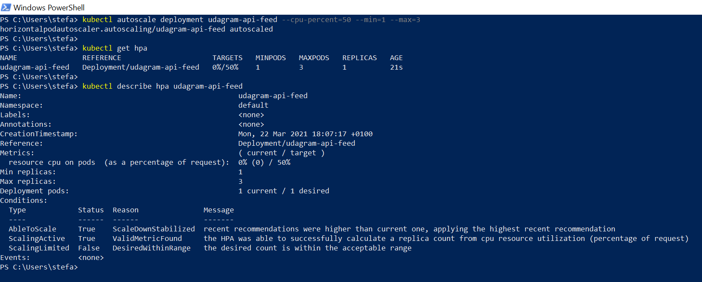

# Udagram Image Filtering Application - Udacity Cloud Developer Nanodegree Project
## 16.Mar.2021 : Stefanos Kotsonis

## Description
This project is is for the [Udacity Cloud Developer Nanodegree](https://www.udacity.com/course/cloud-developer-nanodegree--nd9990), and specifically course 3 **Monolith to Microservices at Scale**. In this course we learn best practices on how to develop and deploy microservices, with a focus on different microservice architecture patterns, independent scaling, resiliency, securing microservices, and best practices for monitoring and logging.

The task is to refactor monolith application to microservices and deploy through [AWS EKS]()
In this project, we  take an existing application named Udagram and refactor it into a microservice architecture with lean services. We build out a CI/CD process using [Travis CI](https://travis-ci.org/) that automatically builds and deploys Docker images to a Kubernetes cluster. The Kubernetes cluster is configured to help solve common challenges related to scale and security.

# Udagram description

Udagram is a simple cloud application developed alongside the Udacity Cloud Engineering Nanodegree. It allows users to register and log into a web client, post photos to the feed, and process photos using an image filtering microservice.

## Project Challenge
Following tasks will have to be performed.
1. **Refactor the API** : Decompose the API code so that we can have two separate projects that can be run independent of one another.
2. **Containerize the Code** : Creating Dockerfiles for the frontend and backend applications. Each project should have its own Dockerfile.
3. **Build CICD Pipeline** : Integrate the GitHub repository with Travis CI, and create a build pipeline that will push the generated images on [DockerHub](https://hub.docker.com/).
4. **Deploy to Kubernetes** : Deploy the Docker containers for the API applications and web application as their own pods in AWS EKS.
5. **Implement Logging** : Define a logging strategy and use logs to capture metrics. As the k8s will be set up with autoscale, it is important our logging strategy allows us to segregate events from different pods.

# Solution
In order The following was implemented as a solution to the project challenge.
## Architecture

The project consists of the following containerized applications:
1. `udagram-frontend` Frontend - Angular web application built with Ionic Framework
2. `udagram-reverseproxy` Reverse Proxy - [Nginx](https://www.nginx.com/) Reverse Proxy to relay requests to internal microservices
3. `udagram-api-feed` Backend RESTful API for posting and processing photos to the feed - Node-Express application
4. `udagram-api-users` Backend RESTful API for handling user login and authentication - Node-Express application

The cloud resources being used for this project consists of:
1. [Amazon S3](https://aws.amazon.com/s3/) Object storage service used for storing the uploaded pictures.
2. [Amazon RDS](https://aws.amazon.com/rds/) Relational database service used for hosting a PostgreSQL database which contains the feeds and users
3. [Amazon EKS](https://aws.amazon.com/eks/) Elastic Kubernetes Service to start, run, and scale Kubernetes applications in the AWS cloud
4. [Amazon KMS](https://aws.amazon.com/kms/) Key management service to allow for the secrets created on Kubernetes to be encrypted (instead of just base-64 encoded)

## Task 1. Refactor the API
Refactoring the API was straightforward. Our previous backend was an Express Node.js web application that was serving the routes `\api\v0\users` and `\api\v0\feed`. Refactoring meant creating two separate Express applications, one for each route.
The important modifications were:
#### AWS RDS and S3 Bucket credentials
Ensuring that credentials are pulled from the enviroment is important, since we our applications will be containerized and available on github as well as docker hub. The following secrets are retrieved by [config.ts](udagram-api-users/src/config/config.ts) from the environment when running:
```typescript
"username": process.env.POSTGRES_USERNAME,
"password": process.env.POSTGRES_PASSWD,
"database": process.env.POSTGRES_DATABASE,
"aws_region": process.env.AWS_REGION,
"host": process.env.AWS_HOST,
"aws_media_bucket": process.env.AWS_S3_BUCKET
```
#### AWS IAM Credentials
Our backends will need to use the proper IAM credentials in order to be allowed to make calls via the [AWS SDK for JavaScript](https://docs.aws.amazon.com/sdk-for-javascript/v3/developer-guide/welcome.html). We need these calls in order to access our AWS resources like the S3 bucket, RDS, etc. This is again implemented via [config.ts](udagram-api-users/src/config/config.ts) with the following:
```typescript
"aws_profile": process.env.AWS_PROFILE
```
AWS will check the credentials of the provided profile to allow for access to resources. Since we will be having containerized apps on k8s, this will require encrypting and providing our `credentials` on the containers when they are deployed. This is explained in the Secrets section below.

#### CORS
Our Cross-Origin Resource Sharing had to be modified, since our monolithic app was restricting access from within our server `localhost`. Now, our clients will be accessing us through their frontend app that will have different IPs. The implemented CORS is as follows:
```typescript
  app.use(function(req, res, next) {
    res.header("Access-Control-Allow-Origin", "*");
    res.header("Access-Control-Allow-Headers", "Origin, X-Requested-With, Content-Type, Accept, Authorization");
    next();
  });
```
#### Allowing the frontend to communicate with the backend
Our frontend communicates with the API through port `8080` and receives the requested data according to the `path` provided. Since we split our backend into separate apps, we need to set up an API Gateway to channel accordingly to the different applications the different paths.
This was implemented by creating a 3rd server application called `udagram-reverseproxy` which is an [Nginx](https://www.nginx.com/) reverse proxy.
Configuration for this reverse proxy is given in [nginx.conf](udagram-reverseproxy/nginx.conf). Our two api apps are defined as the `upstream` and then our nginx will listen on port `8080` and accordingly route to the right app. Excerpt provided below:
```yaml
server {
        listen 8080;
        # Add the header X-Request-ID to the response to the client
        # enable logging
        access_log dev/stdout;
        # add tracking/debugging information in the headers
        proxy_set_header   Host $host;
        proxy_set_header   X-Real-IP $remote_addr;
        proxy_set_header   X-Forwarded-For $proxy_add_x_forwarded_for;
        proxy_set_header   X-Forwarded-Host $server_name;
        # set up routes
        location /api/v0/users {
            proxy_pass http://user;
            
        }
        location /api/v0/feed {
            proxy_pass http://feed;
        }
    }
```
## Task 2: Containerize the apps
### Prerequisite
1. The depends on the Node Package Manager (NPM). You will need to download and install Node from [https://nodejs.com/en/download](https://nodejs.org/en/download/). This will allow you to be able to run `npm` commands.
2. Environment variables will need to be set. These environment variables include database connection details that should not be hard-coded into the application code.
#### Handling Secrets

### Database
A PostgreSQL database was created on AWS RDS. The following secrets are retrieved by [config.ts](udagram-api-users/src/config/config.ts) from the environment when running:
```typescript
"username": process.env.POSTGRES_USERNAME,
"password": process.env.POSTGRES_PASSWD,
"database": process.env.POSTGRES_DATABASE,
"host": process.env.AWS_HOST
```
### S3
Create an AWS S3 bucket. Set the config values for environment variables prefixed with `AWS_` in `set_env.sh`.

### Autoscaling
[Kubernetes Horizontal Pod Autoscaling](https://kubernetes.io/docs/tasks/run-application/horizontal-pod-autoscale/) was set up to allow for scaling our backend api-feed pod when CPU goes over 50%. We set up the HPA on the replication services. 
1. get replication services with command ```bash kubectl get rs ```
   ```
   NAME                              DESIRED   CURRENT   READY   AGE
   frontend-67b5446965               1         1         1       80m
   udagram-api-feed-85dfcb97bf       1         1         1       54m
   udagram-api-users-7c87d97ffc      1         1         1       53m
   udagram-reverseproxy-6d5b57cbcc   1         1         1       10h
   ```
2. set up an HPA for the `udagram-api-feed-85dfcb97bf` replication service
   ```bash
   kubectl autoscale rs udagram-api-feed-85dfcb97bf --min=1 --max=2 --cpu-percent=80
   horizontalpodautoscaler.autoscaling/udagram-api-feed-85dfcb97bf autoscaled
   ```
a screenshot of querying hpa is provided below:

### Backend API


### Frontend App

